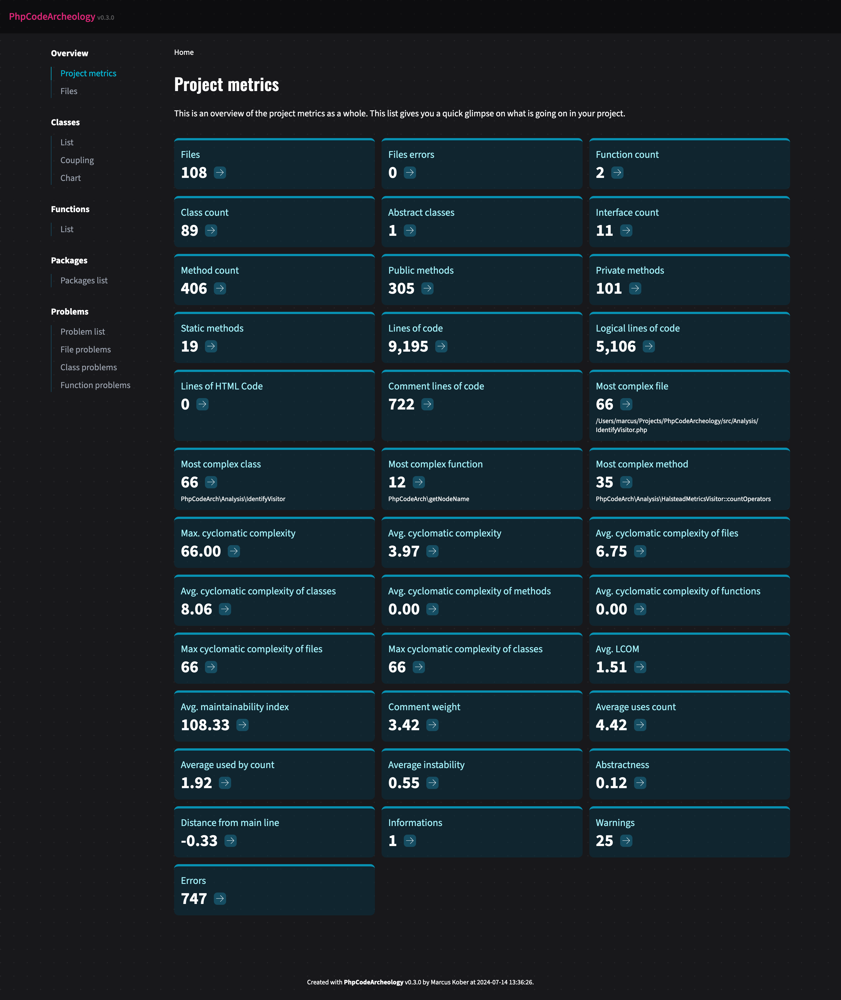

# PhpCodeArcheology

**PhpCodeArcheology** analyzes your PHP project, providing detailed metrics on files, classes, methods, and functions. The comprehensive HTML report equips you with deep insights necessary for evaluating your project.

## Why PhpCodeArcheology?

PhpCodeArcheology was created to help developers gain a deeper understanding of their PHP codebase by providing detailed metrics and insights. Whether you are maintaining a legacy system or working on a new project, this tool aims to facilitate better code quality and maintainability.

## Prerequisites

Ensure your environment meets the following requirements:
- PHP version 8.2 or higher
- Composer installed

## Installation

Install PhpCodeArcheology using Composer by running the following command in your terminal:

```
composer require --dev php-code-archeology/php-code-archeology
```

## Quick start

To start PhpCodeArcheology, run the following command in your project root:

```
./vendor/bin/phpcodearcheology
```

Out of the box, PhpCodeArcheology scans your **src** dir and creates the report in *tmp/report*.

To customize scanning, such as including or excluding folders, defining custom PHP file extensions, or other settings, create a `php-codearch-config.yaml` configuration file in your project root. Refer to this [sample configuration file](php-codearch-config-sample.yaml) for guidance.

## The report

A typical report generated by PhpCodeArcheology includes metrics such as:
- **Files**: Total number of files in the project.
- **File errors**: Count of errors found in files.
- **Function count**: Total number of functions.
- **Class count**: Total number of classes.
- **Abstract classes**: Count of abstract classes.
- **Interface count**: Total number of interfaces.
- **Method count**: Total number of methods, including public, private, and static methods.
- **Public methods**: Count of public methods.
- **Private methods**: Count of private methods.
- **Static methods**: Count of static methods.
- **Output statements**: Count of echo and printf calls.
- **Lines of code (LOC)**: Total lines of code, including comments and empty lines.
- **Logical lines of code (LLOC)**: Total lines of code excluding comments and empty lines.
- **Comment lines of code (CLOC)**: Lines of code that contain comments.
- **HTML lines of code**: Lines of code that contain HTML.
- **Cyclomatic complexity (CC)**: A measure of the code's complexity.
- **Maintainability index (MI)**: An index that indicates the maintainability of the code.
- **LCOM**: Lack of cohesion of methods in classes.
- **Instability**: Measure of a class's stability based on its dependencies.
- **Efferent coupling (Ce)**: Number of classes that a class depends on.
- **Afferent coupling (Ca)**: Number of classes that depend on a class.
- **Difficulty**: Measure of how difficult the code is to understand.
- **Effort**: Estimate of the effort required to understand the code.
- **Vocabulary**: Number of unique operators and operands in the code.
- **Length**: Total number of operators and operands in the code.
- **Volume**: The size of the code's vocabulary and length.
- **Comment weight**: The weight of comments in the code.
- **Distance from main line**: Measure of how abstract and stable a class is.

Here is a sample screenshot of the HTML report:



## Documentation

I am currently working on the documentation. Since I primarily use the tool for my own projects and am focused on its ongoing development, it might take some time to complete a comprehensive documentation.

## Author

Marcus Kober, [@mrcskbr](https://twitter.com/mrcskbr), [GitHub](https://github.com/marcuskober)