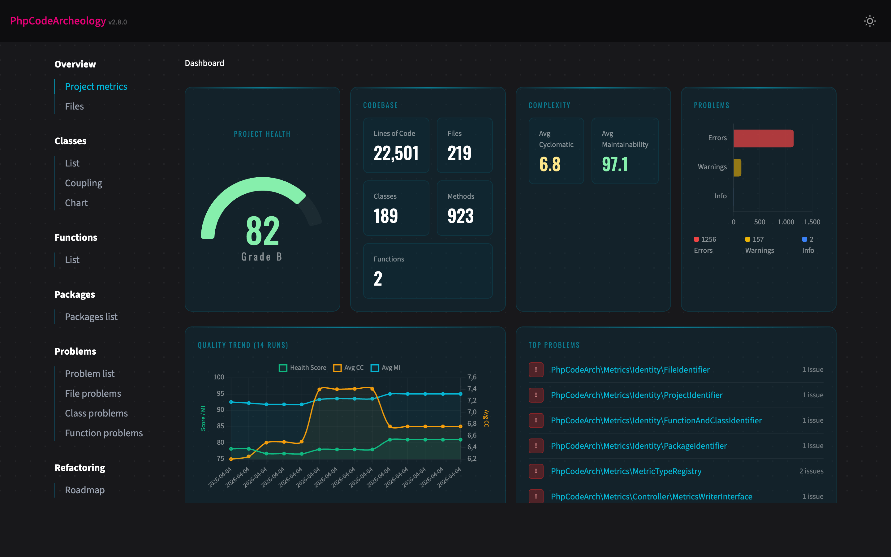

# PhpCodeArcheology

[](https://packagist.org/packages/php-code-archeology/php-code-archeology)
[](https://packagist.org/packages/php-code-archeology/php-code-archeology)
[](https://packagist.org/packages/php-code-archeology/php-code-archeology)
[](https://github.com/marcuskober/PhpCodeArcheology/actions)

**PhpCodeArcheology** is a PHP static analysis tool that measures code quality through 60+ metrics including cyclomatic complexity, maintainability index, coupling, and cohesion. It generates comprehensive reports for files, classes, methods, and functions — detecting code smells, identifying hotspots via git churn analysis, and tracking quality trends over time.

Unlike PHPStan or Psalm (which focus on type safety and bug detection), PhpCodeArcheology focuses on **architecture and maintainability** — giving you the insights you need to understand and improve your codebase structure. Think of it as an alternative to PHPMetrics with deeper git integration, baseline management, and AI-ready output.



## Features

- **60+ code quality metrics** per file, class, and function — cyclomatic complexity, cognitive complexity, maintainability index, LCOM, Halstead metrics, coupling, instability, and more
- **Problem detection** with 13 built-in rules — God Class, too complex, dead code, security smells, SOLID violations, deep inheritance, low type coverage
- **Git integration** — churn analysis, hotspot detection (high churn + high complexity), author tracking
- **Multiple report formats** — interactive HTML, Markdown, JSON, SARIF (GitHub Code Scanning), AI summary
- **Health Score** — single 0-100 score with A-F grading for your entire project
- **Technical Debt Score** — weighted problem score normalised per 100 logical lines of code
- **History tracking** — trend charts across multiple analysis runs
- **Baseline management** — track only new problems, ignore existing ones (ideal for legacy projects)
- **CI/CD ready** — configurable exit codes, SARIF for GitHub Code Scanning, JSON for custom tooling
- **Quick mode** — fast terminal-only output without report generation
- **CLAUDE.md generation** — auto-generated project overview for AI coding assistants

## Prerequisites

- PHP 8.2 or higher (works on 8.2, 8.3, 8.4, 8.5)
- Composer

## Installation

```bash
composer require --dev php-code-archeology/php-code-archeology
```

## Quick Start

Run in your project root:

```bash
./vendor/bin/phpcodearcheology
```

No config file needed — the tool works out of the box. It scans your `src` directory and creates an HTML report in `tmp/report`. Open `tmp/report/index.html` in your browser.

> **Tip:** Add `tmp/report` to your `.gitignore` to keep generated reports out of version control.

To create a config file interactively:

```bash
./vendor/bin/phpcodearcheology init
```

## CLI Options

```
./vendor/bin/phpcodearcheology [options] [path...]
```

| Option | Description |
|--------|-------------|
| `--report-type=TYPE` | Report format: `html` (default), `markdown`, `json`, `sarif`, `ai-summary` |
| `--report-dir=DIR` | Output directory (default: `tmp/report`) |
| `--quick` | Fast analysis with terminal output only, no report generation |
| `--no-color` | Disable coloured terminal output (also respects `NO_COLOR` env) |
| `--fail-on=LEVEL` | Exit 1 on `error` or `warning` (for CI pipelines) |
| `--generate-claude-md` | Generate a `CLAUDE.md` project overview |
| `--git-root=DIR` | Git repository root (default: current directory) |
| `--extensions=EXT` | File extensions to analyse (comma-separated, default: `php`) |
| `--exclude=DIR` | Directories to exclude (comma-separated) |
| `--version` | Show version |

## Subcommands

### `init` — Create Config File

```bash
./vendor/bin/phpcodearcheology init
```

Interactively creates a `php-codearch-config.yaml` with sensible defaults. Detects common source directories (`src`, `app`, `lib`) automatically.

### `compare` — Compare Two Reports

```bash
./vendor/bin/phpcodearcheology compare report-before.json report-after.json
```

Shows a delta view of metrics, problem counts, and lists new/resolved problems. Useful for answering: "Did my refactoring actually help?"

### `baseline` — Track New Problems Only

```bash
./vendor/bin/phpcodearcheology baseline create src
./vendor/bin/phpcodearcheology baseline check src
```

`create` saves the current problem set as a baseline. `check` runs a fresh analysis and reports only problems that are **new** compared to the baseline. Returns exit code 1 if new errors are found — ideal for CI pipelines on legacy projects.

## Configuration

Create a `php-codearch-config.yaml` in your project root (or use `init`):

```yaml
include:
  - "src"

exclude:
  - "vendor"

extensions:
  - "php"

packageSize: 2

reportDir: "tmp/report"
reportType: "html"

git:
  enable: true
  since: "6 months ago"
  root: "."  # Git repository root (useful for monorepos or subdirectory analysis)

qualityGate:
  maxErrors: 0
  maxWarnings: 10

thresholds:
  tooLong:
    file: 400
    class: 300
    function: 40
    method: 30
  tooComplex:
    cc: 10
    ccLargeCode: 20
    difficulty: 20
    cognitiveComplexity: 15
    avgMethodCc: 10
  tooManyParameters:
    warning: 4
    error: 7
  tooDependent:
    function: 10
    class: 20
  lowTypeCoverage:
    warning: 60
    error: 40
  deepInheritance:
    warning: 4
    error: 6
  tooMuchHtml:
    filePercent: 25
    classPercent: 10
    fileOutput: 10
    classOutput: 4
  hotspot:
    minChurn: 10
    minCc: 15
```

All threshold values shown above are the defaults. You only need to specify values you want to override.

## Report Types

| Type | Output | Use Case |
|------|--------|----------|
| `html` | Interactive HTML report with charts | Browser-based review |
| `markdown` | Markdown files | Text-based review, Git-friendly |
| `json` | `report.json` | Machine processing, custom tooling |
| `sarif` | `report.sarif.json` | GitHub Code Scanning, VS Code SARIF Viewer |
| `ai-summary` | `ai-summary.md` | Token-efficient summary for LLM consumption |

## Key Metrics

| Metric | Description |
|--------|-------------|
| **Cyclomatic Complexity (CC)** | Number of independent paths through code. Below 5 is good, above 10 needs attention. |
| **Cognitive Complexity** | How difficult code is to understand (considers nesting depth). |
| **Maintainability Index (MI)** | Composite score from CC, Halstead volume, and LOC. Above 85 is good, below 65 is concerning. |
| **LCOM** | Lack of Cohesion of Methods — how well a class's methods relate to each other. Lower is better. |
| **Halstead Metrics** | Difficulty, effort, volume, and vocabulary based on operators/operands. |
| **Type Coverage** | Percentage of parameters and return values with type declarations. |
| **Instability** | Ratio of efferent to total coupling (0 = stable, 1 = unstable). |
| **Technical Debt Score** | Weighted problem points per 100 logical lines of code. |
| **Health Score** | Overall project quality grade from A (excellent) to F (critical). |

For detailed descriptions, formulas, thresholds, and interpretation guidelines, see the **[Metric Reference](docs/metrics.md)**.

The HTML report also includes a full **Metric Glossary** with descriptions, thresholds, and severity levels.

## Author

Marcus Kober — [GitHub](https://github.com/marcuskober)

## License

MIT
